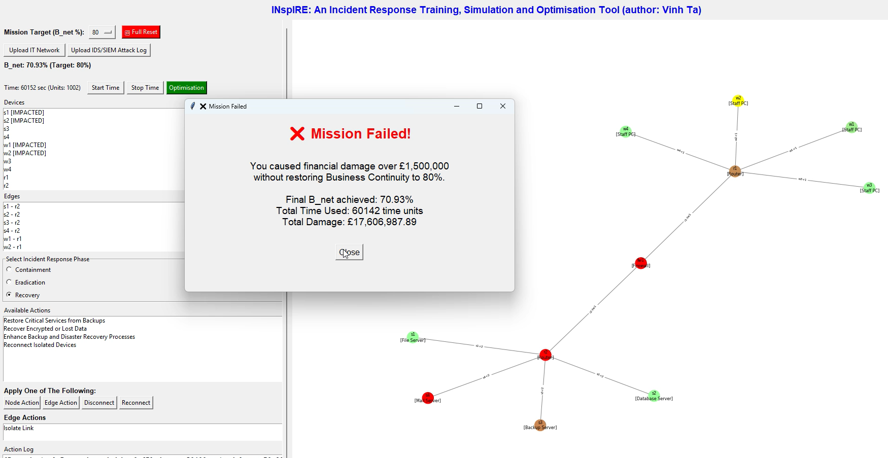
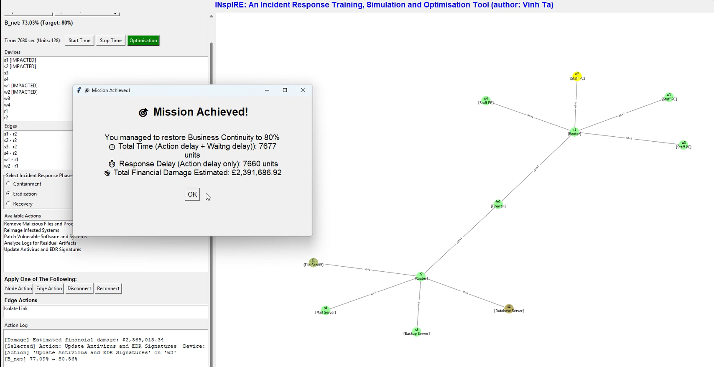

  

# Introduction
**INspIRE** is a cyber Incident Response Simulator, Training and Strategy Optimisation tool. It is an interactive decision-support tool designed for practicing and evaluating incident response strategies in dynamic network environments (including relevant sectors such as health-care, financial, military). Built with realism in mind, this simulator models cyber threats (based on MITRE and CWE databases) such as ransomware, evaluates the effectiveness of defensive and recovery actions, and provides real-time feedback on the so-called **business continuity index** (B_net), financial damage, and system degradation over time.

This tool can be helpful for security analysts, students, and professionals to experiment with containment, eradication, and recovery actions across simulated networks. It offers realistic simulation of progressive actions, supports dependency-aware workflows, and visualises network connectivity and impact propagation while tracking operational and economic metrics like downtime, resilience, and damage cost.

# Research Elements 
The tool incorporates a novel AI-assisted optimisation engine that dynamically assesses the network's evolving health, threat state, and resource availability. Using data generated by generative AI, the system will recommend cost-effective, context-sensitive incident response strategies. This is achieved through an adaptive hybrid approach that integrates metaheuristic techniques with exact methods allowing the system to effectively explore and refine high-impact recovery paths in complex scenarios while handling the "state explosion" problem.

This makes the tool an intelligent advisor, helping organisation prioritise actions, minimise business loss, and provide informed investment decisions. 

# Demo Video 

  <b>Click on the thumbnails below for playing the videos on YouTube:</b>

  <b>Failed Incident Response & Call for Optimisation and Guide:</b>

  

  <b>A Successful Incident Response Guided by the Proposed Strategy:</b>

 

  

